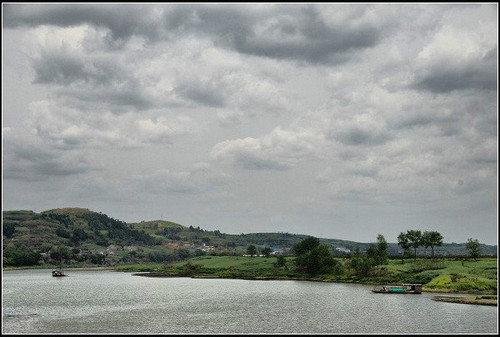
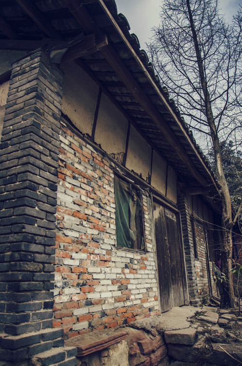
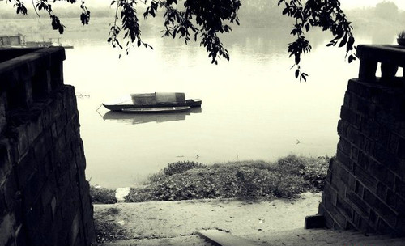
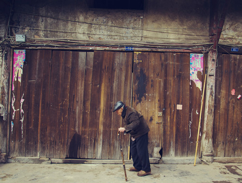
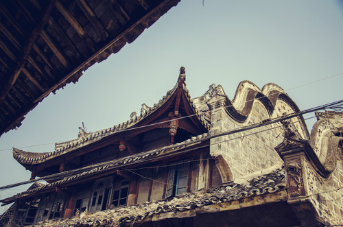
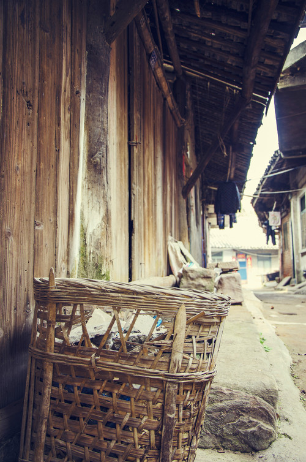
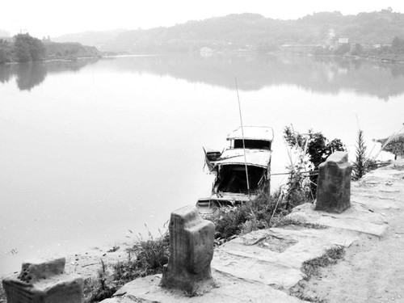

好久不写文章，偶然翻到几张老照片，思绪泛滥得厉害，今天讲一个稍微长一点的故事，当然也会夹带很多私货，故事内容多为我耳闻所得，多数未曾目睹，如有错误，你来打我呀。

（石桥九十年代旧照）

这个故事应该要从宋朝开始讲起。那个时候的石桥，还不叫石桥，也还没有镇，当然更没有我。这里是成都东大路上的一个类似驿站的小地方，用我们四川话叫做“幺店子”。而后，这个幺店子旁建起了一座小的石拱桥，于是“石桥”这个名字就传开了。

如今这个石拱桥在哪里呢？ 咸丰二年（1852年）《重修简州志》中所记载，“州北七里一名双凤桥，一名回龙桥”，双凤桥后来改名叫做回龙桥或者上回龙桥，目前这个桥叫做红星桥。没错，这座桥就是龙门市场口上，紧挨着杨柳沟的那座桥。据说以前这座桥桥面铺石板，面下垫圆木，圆木枕石基。桥面有木质栏杆顶盖，桥中过车马，两侧聚商贩，行人遮风避雨，歇脚纳凉，好不热闹。我小的时候，这座桥上面有一个剃头匠，还记得那时候爷爷慢悠悠地领着我诚惶诚恐地坐上那已经有些年头的椅，前几次因为紧张我只敢死死地盯着桥下的水流，一动不动。椅子的木头已经被时间磨得很光滑，深褐色的木纹我到现在都还记得。而回龙桥后来被称作下回龙桥，结构和上回龙桥一样，现在位于中山街上的那座拱桥便是。这两座桥后来年久失修，重修以后，木石结构不再，原貌不存。实际上，石桥镇中还有另一座桥，叫中回龙桥，只是如今夹藏在周围的房屋中间，已经几乎看不出桥体结构，现在它叫中和桥。当初龙门市场还没兴建之时，三座桥遥相对应，桥下溪水，唤作石桥溪，蜿蜒穿镇而过，汇入沱江。起初溪水清澈见底，水量富足，我爸小时候便常在这溪水当中游泳，常跟我讲起当时偷偷下河游泳，被奶奶打的情景。而今溪水见枯，溪边垃圾随处可见，早已不复当年。偶有临溪的小楼，还看得见当年的影子，却亦如风烛残年，去日不多矣。

石桥古称石桥井，乃因为石桥产盐。乾隆元年时，州判由简州改驻石桥，管理盐业。早在汉朝时期这里便是重要的井盐产地。如今铜观音脚下的那个盐井还伫立着，似灯塔一般，注视着古镇的兴衰。而杨柳沟内的火井湾的由来，便是因当年打的一口盐井。井约70多丈，盐井甫成，工人闻有刺鼻气味，进而引火观看，井气骤燃，当地人便称之为“火井”。后井主人用火井煮盐，月产食盐两万一千斤。如今火井不在，只留下火井湾的称呼在老人口中传述，和一个挖出火井的姑娘的美好的传说。

石桥的兴衰，很大程度上是因为沱江，因为水运。千里沱江，在流经石桥的时候形成了一个很大的回水沱，站在高处望水势走向便能知晓。这里水流平缓，岸高水深，是十分理想的天然内河港口。在铁路建成以前，公路运力也十分匮乏的时候，水路成为物资流转的最重要方式。千百年来，石桥借助得天独厚的水运优势，成为了川中河运的中心，是川内各地的水路交通枢纽。全国各地商人入川采购，均云集于此，石桥被称为“小汉口”。石桥码头常驻船只便有几百艘，加上外地来往客商，码头上停靠的船只有时竟多达千艘。电影中奇妙的水市景观，其实在几十年前就在如今安静的沱江上屡屡上演。近日落，千船靠岸，灯影摇曳。我小的时候码头上偶尔还停靠着几艘船只，港口的那根高高的拴船柱，有十几米高，像流逝的时光中的钉子户，决绝地不肯低头。然而没过几年，也被拆除了。自此码头不在，船亦不现。

（昔日码头之一）

民国时期，国民党在石桥港设立了“四川省水上警察局”，加强对水上运输和贸易的管理。抗战时期，远离战火的四川盆地，仍旧在安稳中迎来每天的日出。而石桥，也正在享受她的巅峰时期。那个时候，石桥为川中四大镇之一，是川内的金融中心，商贸中心和水陆码头，也是简阳县的经济中心，县衙所在地，商业发达，人口密集。当时镇上有全国13大银行的分行，九大码头，超过百家茶铺，商贾云集。因为在石桥经商的外地人奇多，加上“湖广填四川”的浪潮，在石桥的外省人士组建起了同乡会，建立起了六大会馆，包括福建会馆-天后宫，广东会馆-南华宫，山西会馆-关帝庙，两湖会馆-禹王宫，江西会馆-万寿宫和贵州会馆。是时，镇内庙宇四立，香火鼎盛，牌坊云集，洞亭楼阁数不胜数，镇外江上千帆竞起，千樯林立。今日景象，与之不可同日而语。

我爷爷家在陕西会馆的边上，而我家住在大码头。一个在镇场的西南，一个在东北。从小我就在陕西会馆也就是关帝庙那附近玩耍。当然我那个时候，关帝庙已经名存实亡了，当年几米高的关羽铜像，在文革时期已被拉倒不存，威风的青龙偃月刀也不知所踪。我游历玩耍的，是仅剩的残垣和破败的楼宇。当今再看，会馆当时的风貌犹存，气势不减，飞檐雕栏在，但人去楼空，破败之景，令人唏嘘。

（陕西会馆）

我家楼下的路，如今仍旧是青石板铺成。我爸说，当年从水上而来的物资，就从这里上岸，沿着成都的这条东大道，运往省城。这条东大道从我家楼下，一直延伸穿过镇中，再没入竹林深处，再远未可知。道路两旁的铺面，如今还能看到当年繁华的影子，老旧的门板都还在，只是很久都没有人动过了。临江的吊脚楼，拂去灰尘后的牌匾，不时提醒着镇民们曾经属于石桥的繁华。海潮寺，火神庙，凤歧书院，养正书院，如今全已消逝在时代的浪潮中。仅剩下下栅子古城门上依稀认得出的“石桥镇”刻字，老龄协会楼上的栏杆和仅存的古戏台，下回龙桥上的凹凸不平的石板。

呼啸的铁路带走了江水上的船只。高速公路过境，带走了水路的喧嚣。热闹了半个世纪的石桥港，安静而清闲。只在夏天时，河滨会在傍晚变得热闹，河水中纳凉的人数不胜数，一时间竟人头攒动，忽如往日景象重现。我未曾见过江畔的繁华，只能在这种时刻里努力地想象一下。

（沱江畔的渡船）

好生感慨，当初来上海，也算背井离乡，未曾想自此故乡不见春秋，只剩冬夏。近年来更是只能在严冬中回味过去的时光。我时常默念那些古老的地名，水巷子，半边街，回龙桥，大码头，这些有些年头的名字，估计也要随着渐渐坍塌的楼宇慢慢消沉了。每每念起父亲领我介绍镇上的老地方，老街坊，耳畔犹泛起那熟悉的语调。如今，赛不过发展的节拍，清闲安宁的小镇也将要告别她的历史。只是，父亲没有看到。也好，也好。

也好，终不见时光的倾倒；也好，保有这历史的尘嚣。亦如我，未曾见过你的衰老。你看看，时光多可笑。

