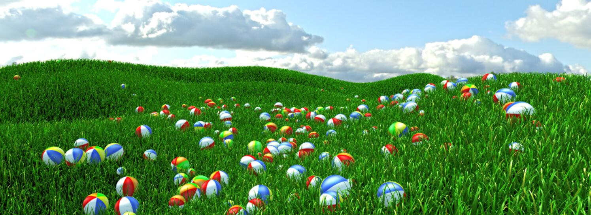
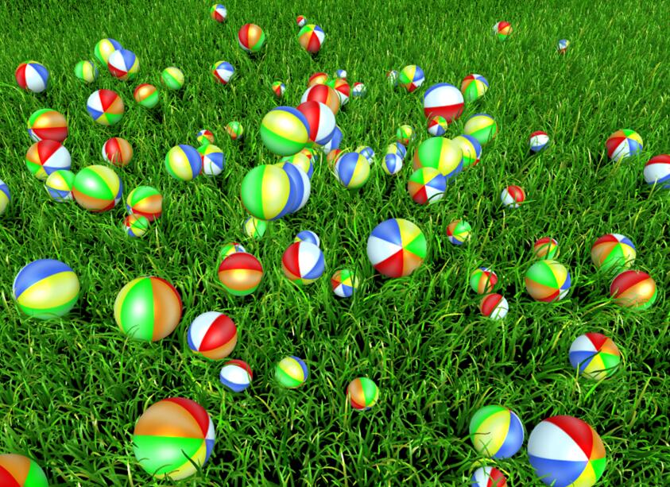

Simulate and render millions of grass blades

This paper is about large scale grass simulation and rendering and was published on I3D 2015, February 27 – March 01, 2015, San Francisco, CA. 

We provide detailed simulated response for individual blades of grass in fields of millions of blades. The field is divided into tiles whose blade data are instanced from a small patch of blades on the GPU to limit memory and bandwidth requirements. We only instantiate simulation state and compute simulation for tiles interacting with objects. The simulation does not stop immediately when objects leave the tile but with a smooth transition to the original GPU-instanced state. Grass motion is solved with collision, length, bending and twisting constraints. Global animation from wind is still handled through conventional, procedural methods in the vertex shader. Our method is also compatible with a rendering level-of-detail (LOD) system. With 128 objects moving in a field with over a million blades of grass, the frame rate is less than 20ms, with only a few milliseconds of that time for simulation.

[Paper](http://developer.amd.com/wordpress/media/2012/10/i3dGrassFINAL.pdf)

[Demo](http://v.youku.com/v_show/id_XODc3NDQ5MTIw.html)